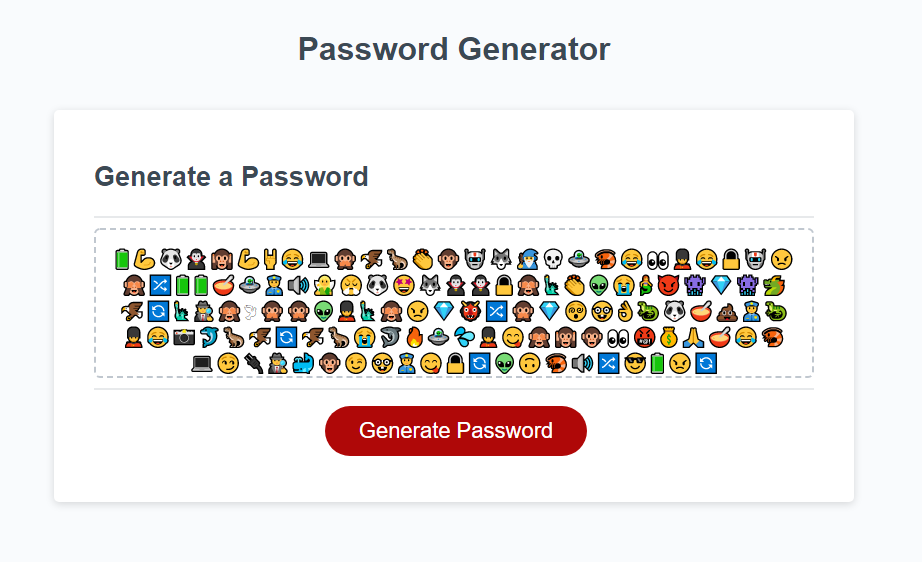

# JavaScript: Password Generator

## Application Function
This application takes in and validates user input in order to pull data from a data set based on the users input and use that data to generate a password from the given data.

## Application Link
https://strawhat19.github.io/Password-Generator/

## Mock-Up

The following image shows the web application's appearance and functionality:

